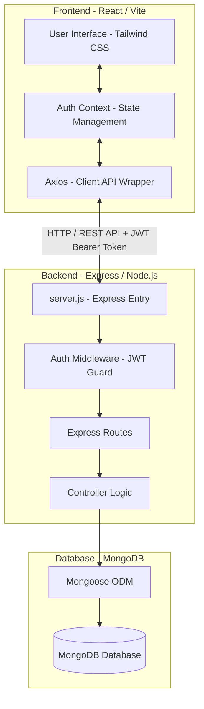

# JobSphere - Complete Project Documentation

Welcome to the comprehensive technical documentation for **JobSphere**, a modern, premium job portal designed to streamline the hiring process for tech talent. JobSphere connects students looking for careers with recruiters looking for qualified candidates through a fast, transparent, and user-friendly interface.

---

## 1. Project Overview & Purpose

**JobSphere** is a full-stack web application designed to eliminate the friction and chaos associated with traditional job hunting and hiring. The application provides dedicated dashboards and tailored workflows for two distinct user groups:
- **Students (Job Seekers)**: Can search and filter active job postings, track the status of their applications in real-time, maintain a rich professional profile (complete with skills, education, projects, certifications, and resumes), and monitor their profile completion score to improve their visibility.
- **Recruiters (Employers)**: Can post new job openings, manage their company profiles, monitor their active job pipeline, and review applicants. The application features a split-screen candidate review interface that lets recruiters view candidate details (bio, projects, skills, education, and resume downloads) and update candidate status (Shortlist, Interview, Reject) in a single click.

---

## 2. System Architecture

JobSphere is built on a **Client-Server architecture** using the **MERN** stack (MongoDB, Express, React, Node.js):



### Key Technologies:
1. **Frontend**:
   - **React 19 & Vite**: A modern web framework and compilation tool for hot-module reloading and high-performance development.
   - **Tailwind CSS**: A utility-first CSS framework for clean, modern, and responsive designs.
   - **React Router DOM v7**: Handles client-side navigation and route protection.
   - **Lucide React**: Premium icon library used throughout the application.
   - **Axios**: Promised-based HTTP client for making API requests, integrated with request interceptors to automatically attach JWT authorization headers.

2. **Backend**:
   - **Node.js & Express**: A lightweight server environment for hosting REST API routes and business logic.
   - **MongoDB & Mongoose**: Mongoose ODM is used to establish typed schemas, manage models, validate inputs, and run database queries against a MongoDB database.
   - **JSON Web Tokens (JWT)**: Used for stateless token-based authorization.
   - **BcryptJS**: Used for cryptographically hashing and verifying user passwords before storage.

---

## 3. Database Schema & Data Models

Mongoose defines five primary collections to model the application data.

### 3.1. User Schema (`backend/models/User.js`)
Stores basic authentication and identity details.
* **name** (String, Required): User's display name.
* **email** (String, Required, Unique): Email address used as the login credential.
* **password** (String, Required): Hashed password.
* **role** (String, Required, Enum): Must be either `'student'` or `'recruiter'`.
* **company** (String): Required only if the role is `'recruiter'`.
* **skills** (Array of Strings): Optional field for students.
* **education** (String): Optional field for students.
* **Timestamps**: Automatically generates `createdAt` and `updatedAt`.
* **Pre-save Hook**: Automatically hashes passwords using a salt factor of 10 if modified.
* **Methods**: Includes `matchPassword()` helper for login verification.

### 3.2. StudentProfile Schema (`backend/models/StudentProfile.js`)
Maintains a rich professional profile for student accounts.
* **user** (ObjectId, Ref: 'User', Unique, Required): References the primary User.
* **title** (String, Default: 'Aspiring Professional'): Headline or role tagline.
* **bio** (String, Default: ''): Personal statement or summary.
* **location** (String, Default: ''): Geographic location.
* **phone** (String, Default: ''): Contact number.
* **skills**: Array of subdocuments containing `name` (String) and `level` (Enum: `'Beginner'`, `'Intermediate'`, `'Expert'`).
* **education**: Array of subdocuments containing `degree` (String), `school` (String), `year` (String), and `grade` (String).
* **projects**: Array of subdocuments containing `title` (String), `desc` (String), and `link` (String).
* **certifications**: Array of subdocuments containing `title` (String), `issuer` (String), and `year` (String).
* **socialLinks**: Object containing `linkedin` (String), `github` (String), and `portfolio` (String).
* **resume** (String): Filename of the uploaded resume.
* **resumeData** (String): Base64 encoded string containing the resume file content.

### 3.3. RecruiterProfile Schema (`backend/models/RecruiterProfile.js`)
Manages business identity details for recruiters.
* **userId** (ObjectId, Ref: 'User', Unique, Required): References the recruiter's User record.
* **fullName** (String, Required): Recruiter's full name.
* **email** (String, Required): Official contact email.
* **phone** (String, Required): Contact number.
* **designation** (String, Required): Recruiter's job role (e.g. HR Manager).
* **companyName** (String, Required): Legal name of the company.
* **companyWebsite** (String, Required): Company URL.
* **industry** (String, Required): Business industry (e.g. Technology).
* **companySize** (String, Required, Enum: `'1-10'`, `'11-50'`, `'51-200'`, `'200+'`).
* **companyLocation** (String, Required): Company headquarters.
* **companyDescription** (String, Required): Company summary.
* **companyEmailDomain** (String, Required): Domain used for verification checks.
* **linkedInUrl** (String, Required): Corporate LinkedIn URL.
* **registrationId** (String): Optional tax/business ID.
* **isVerified** (Boolean, Default: false): Indicates whether profile verification succeeded.
* **verificationStatus** (String, Enum: `'pending'`, `'approved'`, `'rejected'`, Default: `'pending'`).
* **profileCompletion** (Number, Default: 0): Dynamically calculated score.
* **isActive** (Boolean, Default: true): Used for soft deletes.
* **Pre-save Hook**: Evaluates the completion score by checking if mandatory fields are filled, converting the result to a percentage.

### 3.4. Job Schema (`backend/models/Job.js`)
Defines the structure of a posted job opening.
* **title** (String, Required): Job title.
* **company** (String, Required): Hiring company name.
* **description** (String, Required): Job responsibilities and requirements.
* **salary** (String, Required): Salary range.
* **location** (String, Required): Job location (e.g. Remote, City).
* **skillsRequired** (Array of Strings): Desired technical skills.
* **recruiterId** (ObjectId, Ref: 'User', Required): References the User ID of the recruiter who posted it.

### 3.5. Application Schema (`backend/models/Application.js`)
Tracks student applications.
* **jobId** (ObjectId, Ref: 'Job', Required): The job applied to.
* **studentId** (ObjectId, Ref: 'User', Required): The student who applied.
* **status** (String, Enum: `'Applied'`, `'Shortlisted'`, `'Rejected'`, `'Interviewing'`, Default: `'Applied'`).
* **appliedAt** (Date, Default: Date.now): Applied timestamp.
* **Indices**: Compound index on `{ jobId: 1, studentId: 1 }` with a `unique` constraint to prevent students from applying to the same job multiple times.

---

## 4. API Endpoints (Backend REST API)

All backend endpoints are routed through `backend/server.js` and handled by Express controllers.

| Endpoint | Method | Middleware | Description |
|---|---|---|---|
| **Auth** (`/api/auth`) | | | |
| `/register` | POST | Public | Register a new user (generates user record & JWT token). |
| `/login` | POST | Public | Authenticates credentials and returns user metadata and a JWT token. |
| **Jobs** (`/api/jobs`) | | | |
| `/` | GET | `protect` | Retrieves a list of all active jobs for students. |
| `/` | POST | `protect`, `authorize('recruiter')` | Creates a new job posting. |
| `/myjobs` | GET | `protect`, `authorize('recruiter')` | Retrieves only the jobs posted by the logged-in recruiter. |
| **Applications** (`/api/applications`) | | |
| `/apply/:jobId` | POST | `protect`, `authorize('student')` | Submits an application for a job. |
| `/student` | GET | `protect`, `authorize('student')` | Gets the logged-in student's application history. |
| `/job/:jobId` | GET | `protect`, `authorize('recruiter')` | Retrieves list of applicants (complete with profiles) for a specific job. |
| `/status/:id` | PATCH | `protect`, `authorize('recruiter')` | Updates an application status (Shortlist, Reject, etc.). |
| **Profiles** (`/api/profile` and `/api/recruiter`) | | |
| `/api/profile` | GET | `protect` | Retrieves the student profile (returns empty template if not yet initialized). |
| `/api/profile` | PUT | `protect` | Creates or updates the student profile (upsert operation). |
| `/api/recruiter/profile` | GET | `protect`, `authorize('recruiter')` | Gets the recruiter profile (returns 404 if not found). |
| `/api/recruiter/profile` | POST | `protect`, `authorize('recruiter')` | Initializes a new recruiter profile. |
| `/api/recruiter/profile` | PUT | `protect`, `authorize('recruiter')` | Modifies an existing recruiter profile. |
| `/api/recruiter/profile` | DELETE | `protect`, `authorize('recruiter')` | Soft deletes recruiter profile (`isActive = false`). |

---

## 5. Security & Middleware

JobSphere implements robust authentication and error-handling mechanisms.

### 5.1. Authentication Middleware (`backend/middleware/authMiddleware.js`)
- **JWT Protection (`protect`)**: Reads the `Authorization` request header, extracts the Bearer token, verifies it against `JWT_SECRET`, retrieves the user record from the database (excluding the password hash), and attaches the user object to `req.user`. If the verification fails or no token is provided, it returns a `401 Unauthorized` response.
- **Role Verification (`authorize(...roles)`)**: Takes allowed user roles (e.g. `'student'`, `'recruiter'`) and matches them against `req.user.role`. If the user does not possess an authorized role, it returns a `403 Forbidden` response.

### 5.2. Error Middleware (`backend/middleware/errorMiddleware.js`)
- **Global Error Handler (`errorHandler`)**: Catches all unhandled controller exceptions. If the response status code is `200`, it escalates it to a `500 Server Error`. It formats the error output as a JSON response:
  ```json
  {
      "message": "Error message description",
      "stack": "Stack trace (null in production mode)",
      "errors": "Mongoose Validation details (if any)"
  }
  ```

---

## 6. Frontend Features & Core Components

The frontend application utilizes React context and reusable Tailwind components to build a responsive, feature-rich interface.

### 6.1. State Management & Navigation (`src/context/AuthContext.jsx`)
- **Authentication Context (`AuthProvider`)**: Centralizes authorization state (`user`, `loading`).
  - Checks `localStorage` on page load to restore sessions automatically using stored tokens.
  - Exposes `login()`, `register()`, and `logout()` workflows.
  - Automatically appends headers to outgoing API requests via Axios interceptors in `src/utils/api.js`.
  - Exposes `updateUser()` to synchronize state changes (e.g., changes to names or emails) across the Navbar and Sidebar.

### 6.2. Common Layout Components
- **MainLayout (`src/components/layout/MainLayout.jsx`)**: The master template. If the user is authenticated, it renders a sticky header (**Navbar**) and a responsive sidebar (**Sidebar**) wrapping the core routing outlet.
- **Navbar (`src/components/layout/Navbar.jsx`)**: Features a responsive design, navigation links based on user roles, notification dropdown preview, and profile link.
- **Sidebar (`src/components/layout/Sidebar.jsx`)**: Houses navigational routes (Dashboard, My Applications, Post Job, Profile, Settings) and displays user online status, dynamic profile initials, and a premium membership promotion widget.

### 6.3. User Dashboards & Pages
- **Landing Page (`src/pages/LandingPage.jsx`)**: A visually rich entrance featuring dynamic gradients, custom metrics (12k+ jobs, 8k+ companies), value propositions (verified profiles, remote hiring), a contact card, and quick sign-up redirects.
- **Student Dashboard (`src/pages/dashboard/StudentDashboard.jsx`)**:
  - Displays search inputs with pre-configured filters (Remote, Full-time, salary ranges).
  - Summarizes job search progress (Applied, Shortlisted, Interviewing).
  - Integrates a profile completion widget containing items like resume upload status, skills, and education details.
- **Recruiter Dashboard (`src/pages/dashboard/RecruiterDashboard.jsx`)**:
  - Enables recruiters to post new jobs and view active openings in a clean layout.
  - Tracks candidate counts per job with quick action links to candidate evaluation queues.
- **Job Applicants Evaluation (`src/pages/dashboard/JobApplications.jsx`)**:
  - A split-screen master-detail layout.
  - On the left, it lists all applicants with application dates and color-coded status badges.
  - On the right, it shows detailed candidate profile information (bio, projects with links, educational background, skills, and resume downloads).
  - Features action buttons to update the candidate's status to **Shortlisted**, **Interviewing**, or **Rejected** in real-time.
- **Student Profile Management (`src/pages/profile/Profile.jsx`)**:
  - Integrates direct inline editing of student location, bio, education history, projects, certifications, and skills.
  - Features file reading utility for resume upload, storing files as base64 strings in the database, allowing recruiters to download the files immediately.
- **Recruiter Profile Management (`src/pages/recruiter/RecruiterProfile.jsx`)**:
  - Enables recruiters to initialize or edit contact and verification details, including designation, official email, phone, company website, location, description, email domain, and LinkedIn link.
  - Supports verification status badges (Pending, Approved, Rejected).
  - Features an account deletion action.
- **Settings page (`src/pages/settings/Settings.jsx`)**:
  - Separates preferences into tabs: Account Info, Notifications (Job Alerts, Application Updates, Security, Marketing toggle switches), Privacy (Profile visibility options), and Password Security changes.

---

## 7. How the Application Works (End-to-End Workflow)

Here is a step-by-step example of how JobSphere manages data from candidate registration to hiring approval.

### 7.1. User Setup & Profile Completion
1. A student registers an account by inputting their name, email, role, and password. The backend hashes the password, creates the user document, signs a JWT token, and returns the session state to the browser.
2. Upon login, the client app stores the JWT token in `localStorage`.
3. The student navigates to the **Profile** page. They upload their resume (converted to a base64 string) and fill in details such as location, skills, projects, and education. Clicking **Save** triggers a `PUT` request to `/api/profile`, creating or updating the student profile.
4. The dashboard calculates their completion score and shows checklists for remaining profile details.

### 7.2. Job Posting
1. A recruiter registers, sets up their company profile, and goes to **Post a Job**.
2. They input details like Title, Company, Salary, Location, Skills, and Description. Submitting the form calls `POST` on `/api/jobs` (authorized for recruiters only).
3. The job details are stored in the database, associated with the recruiter's User ID.

### 7.3. Application & Evaluation
1. The student logs in, reviews recommended listings on their dashboard, searches for roles, and clicks **Apply Now** on a job details page.
2. The application controller calls `POST` on `/api/applications/apply/:jobId`. It checks for duplicate applications, and if none exist, inserts a new application record with status `'Applied'`.
3. The recruiter logs in, navigates to their dashboard, reviews active jobs, and clicks **Applicants** on their posting.
4. The backend retrieves the applications, looks up the corresponding candidate user profiles via a `$in` query, matches the profiles to the applications, and returns the combined payload.
5. The recruiter clicks on a candidate's card to view their full profile. They can download the candidate's resume or update the application status to **Shortlisted** or **Interviewing**.
6. When the recruiter changes the status, a `PATCH` request is sent to `/api/applications/status/:id`. The candidate's dashboard and application tracking history are instantly updated.
